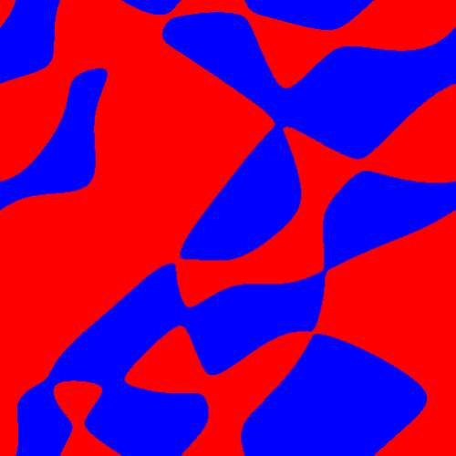
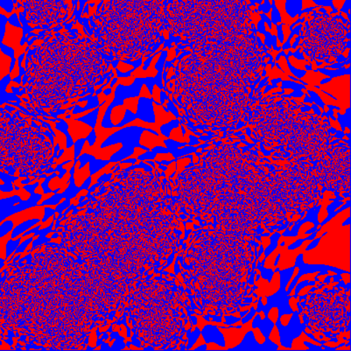

# Astowell.jl

In the far East Reach, beyond the last land, there are the fractal Fermion nodes. 

 

Currently there is a notebook which implements a minimal Julia code which reproduces similar figures to those in the 2008 PRB.

# Bibliography

> Fermionic quantum criticality and the fractal nodal surface. 
> Frank Krüger and Jan Zaanen. 
> Phys. Rev. B 78, 035104 – Published 3 July 2008. 
> https://doi.org/10.1103/PhysRevB.78.035104
